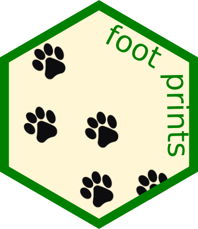

# Footprints 
Reading and analyzing macroinvertebrates' trajectories

## Getting started

### Prerequisites
This is an _R_ package. [_R_](https://www.r-project.org/) is required, [_RStudio_](https://www.rstudio.com/) is recommended.

### Installing
Type `devtools::install_github("PabRod/footprints")` in your `R` command console.

### Running the tests
The integrity of this package can be checked by running `devtools::test()`. 
The battery of tests available is stored at `./tests/testthat`.

## Authors
- [Pablo Rodríguez-Sánchez](https://pabrod.github.io)
- [Sanne J.P. van den Berg](https://www.wur.nl/en/Persons/Sanne-dr.-SJP-Sanne-van-den-Berg.htm)

## License
This project is licensed under the MIT License - see the [LICENSE.md](LICENSE) file for details
